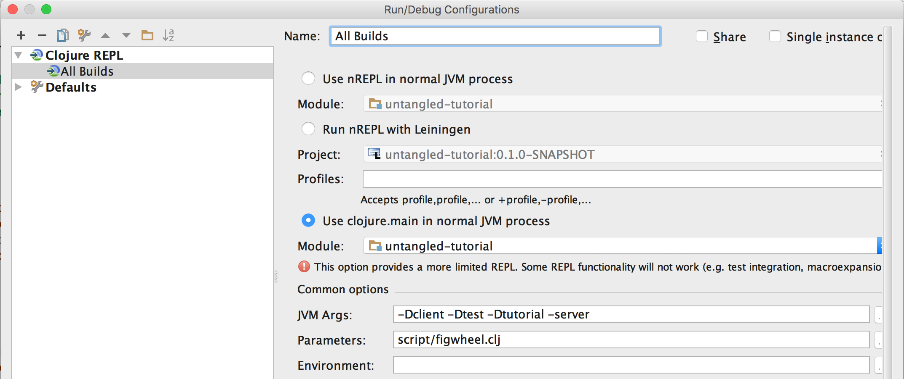

# Untangled Tutorial 

This is an interactive tutorial for developing applications with 
the Untangled web framework.

It is really meant to be cloned locally, as the 
exercises require you to extend and edit the code.

## What's inside?

This tutorial covers all of the elements of the Untangled 
framework, including the necessary elements of the underlying
Om library (on which much of the system is based):

- Recommended Development Environment
    - IntelliJ/Cursive
    - Adding Run Configurations for client and server
    - Running Figwheel w/REPL Integration
    - Running Server REPL
    - Running Selected Builds with REPL
        - Switching Client REPLs
- The critical elements of Om UI
    - Application database format
        - Tables
        - Idents
        - Building out the graph
    - Queries
        - Properties
        - Joins
        - Unions
    - Constructing UI
        - Colocated queries and Idents
        - Normalization
        - Initial state
- Untangled extensions for UI
    - Built-in Om parser
    - Rationale for reductions of complexity (and flexibility) from standard Om Next
    - Built-in UI mutations
    - Making the UI dynamic
        - Basic mutations
        - (e.g. tabs, sub-tabs, modal dialogs)
    - Internationalization
    - Logging
- Server integration 
    - The Untangled server
        - Server Side Query processing
            - Parsing Queries
        - Parsing/Processing Mutations
            - Tempids
    - Network plumbing guarantees sequential processing
    - Tempid Handling
        - Support for returning :tempids from server action
        - Automatically fixed in client state (no code required)
        - Tempids rewritten in network send queue
    - Support for UI/Server data separation in queries
        - Elision of :ui/... attributes in server queries
    - Advanced Merging
        - Deep merging
        - Behavior when merging to existing entities

The following builds are configured in figwheel:

`tutorial`: Devcards with a tutorial 
`client`: A full-stack application (that you extend)
`test`: Sample tests for understanding the testing framework

## Running it

### IntelliJ/Cursive

The project is set up for an optimal experience in IntelliJ with Cursive:

- Running selected figwheel builds using run configurations
- Integration with REPL commands (e.g. send form to REPL from editor)

To accomplish this, we chose to use figwheel sidecar and script it. The
code is organized so that if you wish to use nREPL with Emacs/vi you
can get the same features (documentation coming soon).

The `dev/server/user.clj` contains the primary code, which is in turn 
invoked by the `script/figwheel.clj` file. You select builds by specifying
`-Dbuild_name` as a JVM option (any number of times). Thus, you can
run one or many builds.

To configure this in IntelliJ:

- Edit Run Configurations
- Press +, and add a Clojure Local REPL. Name it something like "All builds"
- Choose "Use Clojure Main" (see image below)
- Add `-Dn` options to the JVM Args for each build you want to run, where `n` is a build
defined in the `:cljsbuild` section of the `project.clj` file.
- Set parameters to `script/figwheel.clj`



You should now be able to run the builds via the IDE.

### Command line

```
JVM_OPTS="-Dtutorial" lein run -m clojure.main script/figwheel.clj
```

Then browse to the following URL:

```
http://localhost:3450/tutorial.html
```

## Figwheel notes

Once the figwheel REPL is going, you can clean and rebuild with 

```
(reset-autobuild)
```

after which you probably want to reload the page in your browser to clear out any cruft.

Sometimes (rarely) it is necessary to just stop it all, clean everything with `lein clean` and
restart.


